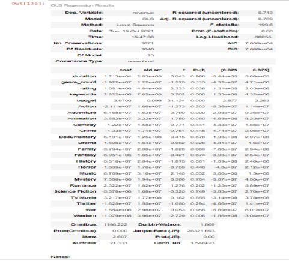
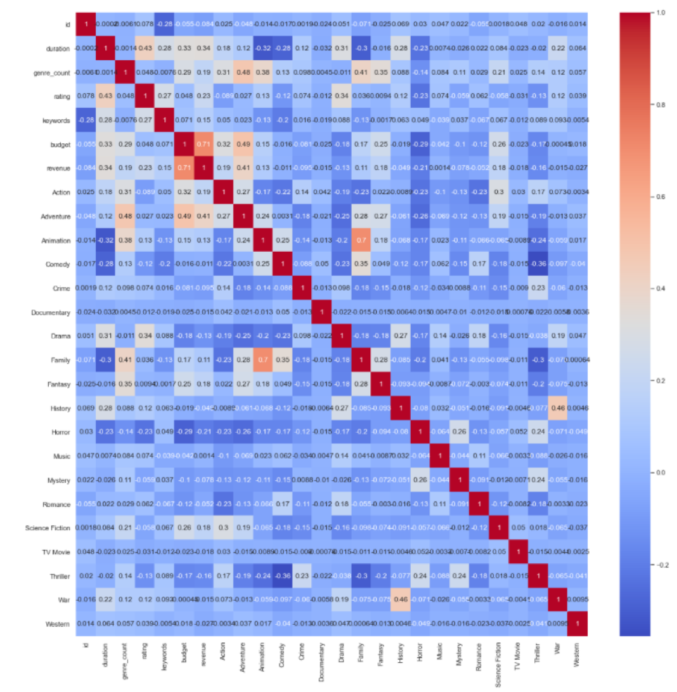

## MVP

We were able to Scrape the data from themoviedb.org to get the information for the movies and other related info like the year and the rating.
We scraped 3621 rows from the website and after doing the EDA we had 1821 rows to work on in the regression and our target is to predict the revenue.

Our Starting goals were:
-----------------------
- Investigate the relationship between movie user rating and revenue. What is the expected revenue for a movie given a specific user rating?

- Can we predict user rating for a movie given the total budget and the number of genres which the movie belongs to?

After building the model we did the OLS regression method and got these results from the function:

As we can see in the screenshot above, we can see the R^2 scores and the R-adj, and it’s around 0.70.
After the OLS we are planning to use these models:
-	Linear Regression
-	Lasso
-	Ridge
-	Cross validation

In the heatmap below we can see the correlation relationship between the target values to other columns. We can see a correlation relationship between the revenue and other columns. Also, there is a correlation between the animation column and the family column. 

